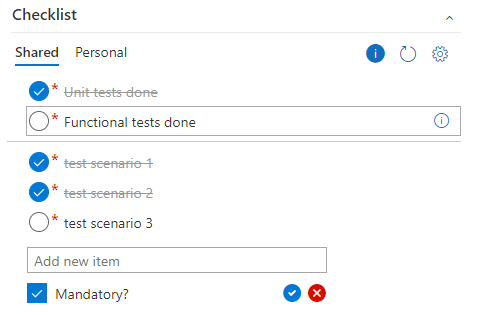
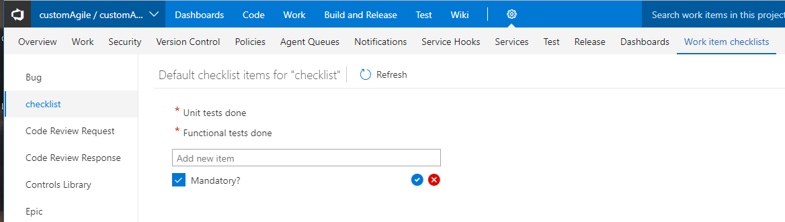

# Work Item checklist

A work item form group extension that lets user enter TODO list items for an individual workitem. These list items are stored in the extension's data storage and not as a field value or any other work item. These items are not bound to any work item field. 
Users can add, remove any checklist item and mark them as checked or unchecked. This extension shows 2 types of checklists - "Personal" and "Shared". Personal checklist is private to each user. Shared list is shared with the whole account for a workitem. The items are stored per workitem, so each workitem would have its own checklist.

Users can also add certain default checklist items for a work item type by going to "Work item checklist" settings hub, or by clicking the gear icon on the checklist group on work item form.

These default checklist items would show up for all the workitems of that work item type in the current project. The state of these default items would still be maintained at each work item's level. For eg. In the screenshot above, "Unit tests done" and "FUnctional tests done" are 2 default checklist items which would show up in each "checklsit" work item. But if a user checks "Unit tests done", it would only be checked for that particular work item.
Default items are not sortable or removable from work item form. Users can do that via tha settings hub.

# Changelog

**(05/06/18) Version 3.0:** 
* Added support for adding default checklist items for a work item type.

**(02/07/18) Version 2.1:** 
* Added functionality to edit a checklist item. Click on the "Pencil" icon in a checklist item row to open the edit view.
* Added functionality to reorder checklist items. On hover on each checklist item, a drag handle would now appear. Users can drag a checklist item via the drag handle and drop it at desired location to reorder the list.
* Added functionality to mark a checklist item as "mandatory". This can be done during checklist item creation or can be set via edit view too.
* Ability to add a state to each checklist item. This can be done in edit view of a checklist item.
* "Shared" view is now the default view.