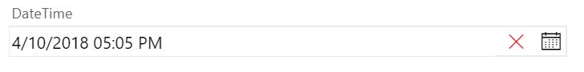
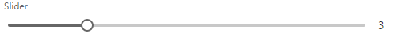
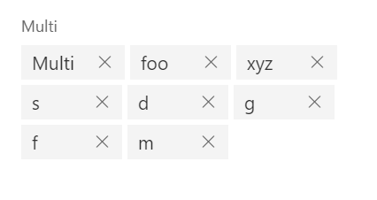

# VSTS Work item form control library
This extension is a library of several custom controls targeting work item form. A work item form in VSTS can be extended via extensions. Users can write their own custom controls, groups or pages that would show up in VSTS work item form in web. For reference, visit <a href="https://docs.microsoft.com/en-us/vsts/extend/develop/add-workitem-extension?view=vsts">Extend the work item form</a>.

If you are using TFS, you can add these controls to work item form via work item type xml file - <a href="https://docs.microsoft.com/en-us/vsts/extend/develop/configure-workitemform-extensions?view=vsts">Add extensions in work item form via work item type definition xml</a>.

If you are using VSTS, you can add them from process admin page -<a href="https://docs.microsoft.com/en-us/vsts/work/customize/process/custom-controls-process?view=vsts">Add or modify a custom control for a process and WIT</a>.

A work item form custom control can take some user inputs to configure the control. I'll describe what inputs are required for eah of the control below.

This extension is an attempt to provide samples to other users to help them write their own extensions targeting work item form. There are 6 work item control contributions in this extension -

* <a href="#datetime">DateTime Control</a>
* <a href="#pattern">Pattern Control</a>
* <a href="#slider">Slider Control</a>
* <a href="#rating">Rating Control</a>
* <a href="#multivalue">Autocomplete Multivalue Control</a>
* <a href="#plaintext">Plain Text Control</a>

The code for this extension is on <a href="https://github.com/mohitbagra/vsts-extensions/tree/master/src/ControlsLibrary">github</a>

#### DateTime Control ####
A custom date time control for DateTime fields which also lets users pick time, which is not possible by the default DateTime control on work item form.

To select a date or time, click the calendar icon on the right.

>*Inputs* -
>1. **FieldName** *(required)* - A DateTime field associated with this control. The value of the datetime control would be bound to this field's value.

#### Pattern Control ####
A custom text control for string or multiline string fields which restricts the field value to a certain regex pattern. Note that the restriction would only work in this custom control as the pattern would not apply to the actual work item field. If users enter a wrong pattern in this control, it'll show an error below the control but the work item would still be saveable because work item form extensions cannot block work item save right now. 

In the example above, there are 2 instances of pattern control - the first one requires the value to be an email. The 2nd one requires it to be a phone number. If the value entered by user doesnt match the pattern, it'll show an error.
If the value matches the pattern, then no error would be shown. Note that work item would still be saveable even if the control shows error.

>*Inputs* -
>1. **FieldName** *(required)* - A String or a Multiline string field associated with this control. The value of the pattern control would be bound to this field's value.
>2. **Pattern** *(required)* - A regex pattern for this control. It should be a valid javascript regex pattern string without the leading and trailing forward slash character.
>3. **ErrorMessage** *(required)* - A custom error message to be shown to user if the value entered in the control doesnt match the pattern.

*Some common regex patterns*
1. **Email** - ^(([^<>()\[\\]\\.,;:\s@"]+(\.[^<>()\[\\]\\.,;:\s@"]+)*)|(".+"))@((\[[0-9]{1,3}\.[0-9]{1,3}\.[0-9]{1,3}\.[0-9]{1,3}])|(([a-zA-Z\-0-9]+\.)+[a-zA-Z]{2,}))$
2. **Phone Number** - ^[\+]?[(]?[0-9]{3}[)]?[-\s\.]?[0-9]{3}[-\s\.]?[0-9]{4,6}$
3. **Guid** - ^[0-9a-f]{8}-[0-9a-f]{4}-[1-5][0-9a-f]{3}-[89ab][0-9a-f]{3}-[0-9a-f]{12}$
4. **URL** - https?:\/\/(www\.)?[-a-zA-Z0-9@:%._\+~#=]{2,256}\.[a-z]{2,4}\b([-a-zA-Z0-9@:%_\+.~#?&//=]*)

#### Slider Control ####
A custom control that shows a numeric field as a slider control

>*Inputs* -
>1. **FieldName** *(required)* - A numeric field (Integer or Decimal) associated with this control. The value of the pattern control would be bound to this field's value.
>2. **MinValue** *(required)* - The min numeric value of the field.
>3. **MaxValue** *(required)* - The max numeric value of the field.
>3. **StepSize** *(required)* - The numeric step size for the slider.

#### Rating Control ####
A custom control that shows an integer field as a star rating control

>*Inputs* -
>1. **FieldName** *(required)* - An integer field associated with this control. The value of the pattern control would be bound to this field's value.
>2. **MinValue** *(required)* - The min integer value of the field.
>3. **MaxValue** *(required)* - The max integer value of the field.

#### Autocomplete Multivalue ####
A custom control that lets user pick multiple values for a string (or a multiline string) field using an autocomplete widget.

>*Inputs* -
>1. **FieldName** *(required)* - An integer field associated with this control. The value of the pattern control would be bound to this field's value.
>2. **Values** *(required)* - A semicolon separated string of suggested values for the control.

#### Plain Text Control ####
A custom control that shows the configured markdown string as text. This control is not bound to any field. It supports markdown (https://github.com/markdown-it/markdown-it), so you can show rich text with links and images if you choose so. The control also looks for certain "patterns" in the string where it can replace certain text dynamically.
For eg.- You can use ${@fieldValue} macro anywhere in the text and this text will be replaced during runtime by reading the field value from current work item.
Eg: If the configured text is -

>1. Url: https://mbagra.visualstudio.com/DefaultCollection/customAgile/_workitems/edit/${@fieldValue=ID}
>2. Assigned to value is ${@fieldValue=Assigned To}
>3. State value is ${@fieldValue=State}

It would be printed as -
>1. Url: https://mbagra.visualstudio.com/DefaultCollection/customAgile/_workitems/edit/208
>2. Assigned to value is Mohit Bagra mbagra@microsoft.com
>3. State value is New

>*Inputs* -
>1. **Text** *(required)* - The text to show in the control.
>2. **MaxHeight** *(required)* - Maximum height to which the control should resize.