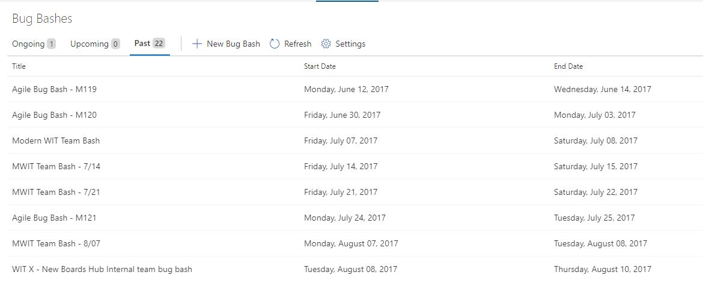
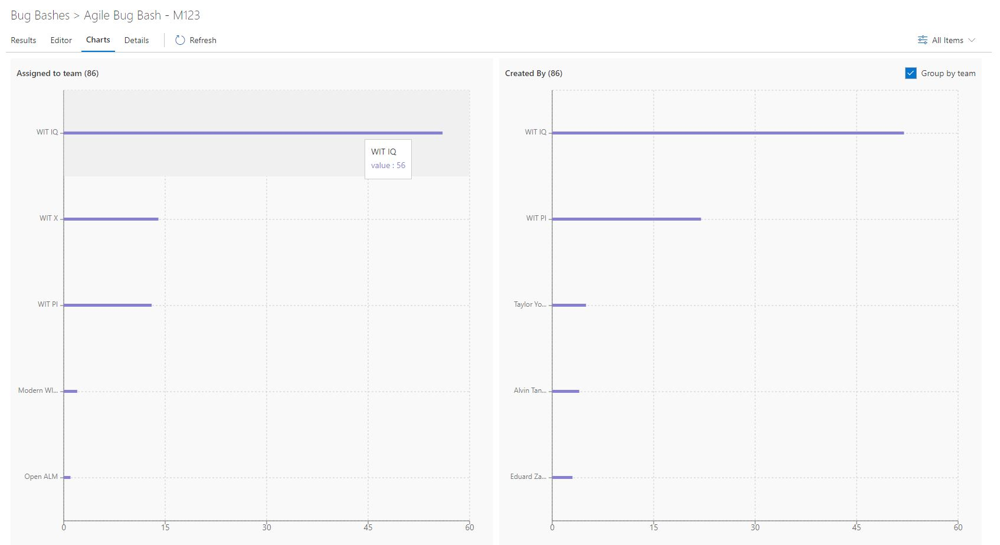

# Bug Bash Pro

# Manage team wide bug bashes
A work hub extension that lets teams manage their bug bashes in a more efficient manner. When a new feature is being tested either org wide or team wide, a lots of bugs are created and its hard to track all the bugs created in one instance of testing and triage them. Users can use features like work item templates to use pre-defined set of field values while creating bugs and then track them using work item queries, but its a tedious process in 2 ways - 

1. A work item form needs to be opened each time to create a workitem.
2. To track all workitems in the bug bash, you need to navigate to the query view which makes you lose work item form view.

Some teams use tools like OneNote or other note syncing apps where users can track bugs, but then someone has to manually create VSTS workitems from that note.

This extension tries to simplify this in 2 ways -

1. Quickly create new bug without actually creating a real work item for it.
1. View all the bugs created in a bug bash instance while creating a new bug.
2. Quickly create new items, accept them if they are valid bugs and get a quick report on how many bugs were created per team and who filed most number of bugs and deserves a prize :).

#### Overview ####
The home page of the extension shows all the past/ongoing/upcoming bug bash instances. 

To create a new bug bash instance, click "New", which opens the bug bash editor

You can enter bug bash information in the editor to create it. Here are the properties of a bug bash instances -

1. **Title** *(required)* - The title of the bug bash instance
2. **Start Date** - A start date for the bug bash. This is not a required field. An empty start date means the bug bash is ongoing until it ends.
3. **Finish Date** - An end date for the bug bash. This is not a required field. An empty end date means the bug bash never ends.
4. **Work item type** *(required)* - Describes which type of workitem this bug bash instance associates with. 
5. **Description Field** *(required)* - Describes which HTML field does the item description bind to when you accept an item to create VSTS work item.
6. **Auto Accept** - Whether the item would be auto accepted as soon as its created. By accept, it means that a VSTS work item is created for the bug bash item.
7. **Template Team** - Pick a team to populate work item templates for that team.
8. **Work item template** - You can choose a work item template that would be used to autofill certain field values for each new workitem created in this bug bash instance when accepting a bug bash item. A work item template can be created from VSTS team admin view. Note that work item templates are team scoped, so in this dropdown, you can only choose templates which are in the scope of the selected "Template team".

*P.S.* : Work item templates are defined per team per workitem type. The template dropdown shows all templates in the selected team (for all work item types). Users should pick a template corresponding to the selected "Work item type" in the bug bash.

Once saved, click on "Results" to go to the results view of this bug bash instance.

The results page shows 2 things -
1. A results grid which shows the items created in this bug bash.
2. An item editor where users can create new items or edit existing ones.

You can choose the view of results grid from the filter at top-right (next to the result count number) -

1. **Pending Items** - It shows all the items which are not yet accepted. By accepted, I mean that no VSTS work items have been created for these items. When you create any new item (if the Auto accept is turned off in the bug bash instance), it just creates a bug bash item without creating any work item for it. Only when you accept it, it will create an actual VSTS work item based on the work item template selected during the bug bash creation. Each item can be edited in this list by clicking the row.
2. **Accepted Items** - It shows all the items which have been accepted. Since accepted items are in fact real VSTS work items, to edit them, you need to open the VSTS work item form. This list shows a work item grid and to open a work item you can double click the row or click the title. Accepting an item is an irreversible step.
3. **Rejected Items** - It shows all the items which are rejected. To reject an item, select the item from "Pending Items" grid and from the item editor, select the "Reject" checkbox, fill in a "Reject Reason" and save it. Once saved, this item will start showing up in the Rejected Items grid. Note that a rejected item can still be "Accepted" in future or moved back to "Pending items" list.

To create or edit any pending item, you can use the item editor at the right side of the results page.
When a new item is created, it will store the title, description and team into the item's data. When the item is accepted, the title and team from the item would be used to fill the title and team field (area path for VSTS) of accepted work item. And the description would be filled in the description field selected during bug bash creation.

Users can also start a discussion for a item in the item editor.

When the item is accepted, these discussions would be synced to the accepted work item in a single work item comment.

Other features -

 **Charts** 
 
 Users can click on the Charts pivot on results page to get a consolidated view of all items in a bar chart.

It shows 2 charts - one showing count of items assigned to each team. The other shows count of workitems created by each user or team. A user can associates a team for himself in the current project by clicking on "Settings" on extension home page.

 **Details**
 
  Users can fill in extra details for a bug bash by going to the Details pivot. Click on edit to enter the edit mode, fill in details and hit save to save the details.

 **Image paste/upload in item editor** 
 
 Users can copy paste an image directly into the item editor or bug bash details editor. Users can also upload an image file from their local machine. These images would be saved to a git repo in the current project which can be configured in the Bug bash settings from extension's home page.

 **Settings**
 
  Users can view/edit settings from extensions's home page by clicking on Settings button.

 

Users can configure 2 things here -

    1. Select a git repo where all the media would be saved (copy pasted or uploaded images).
    2. Select a team in the current project associated with you. This team info would be used in the Charts view to assign your bug count to your associated team.

# Changelog

**(03/03/18) Version 3.3:** 
* Added "All" pivot in results and charts view to show all the items irrespective of whether they are pending or rejected or accepted.
* Fixed a bug where accepted work items wont load if their number is too high (around 200+).
* Fixed a bug where discussion comment was not getting saved if it was added during creation of a bug bash item.

**(02/07/18) Version 3.1:** 
* Set default team  for a bug bash. Can be configured in bug bash editor. All bug bash items would be defaulted to the selected team. Users can still change the team.
* Stand alone view of a bug bash item. Users can now double click on each row in bug bash results grid to open the selected bug bash item in full view. You can then share the url with other people for that particular bug bash item.
* Bug bash item editor now shows created by and created date info.
* Performance improvements
