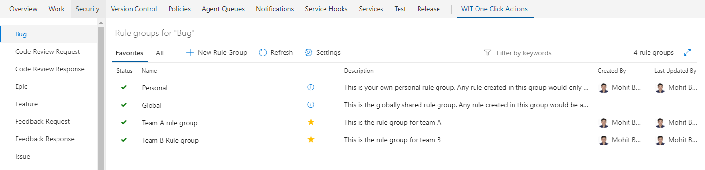
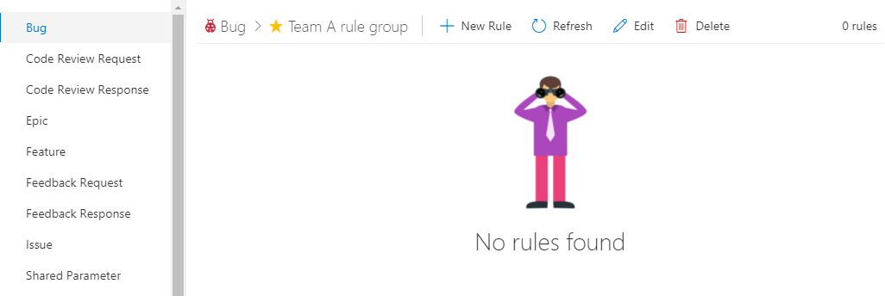
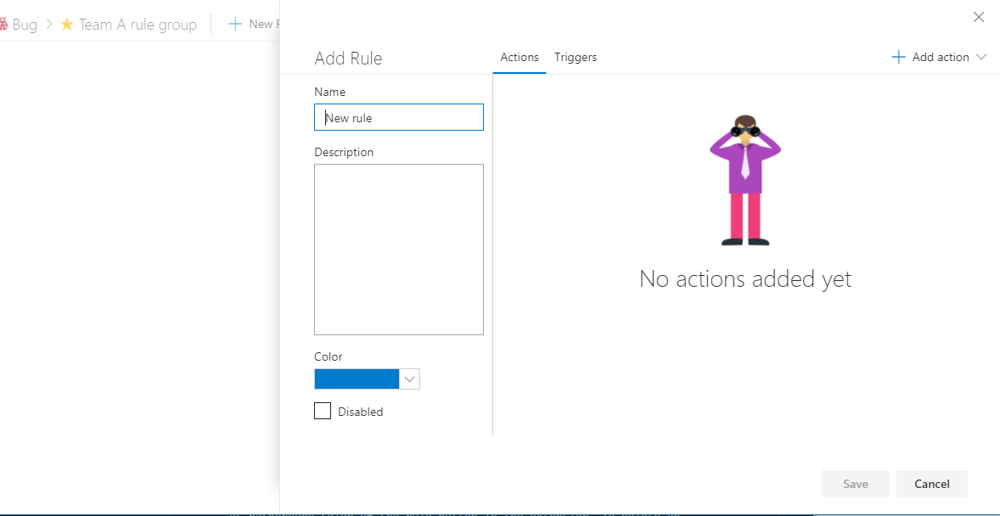
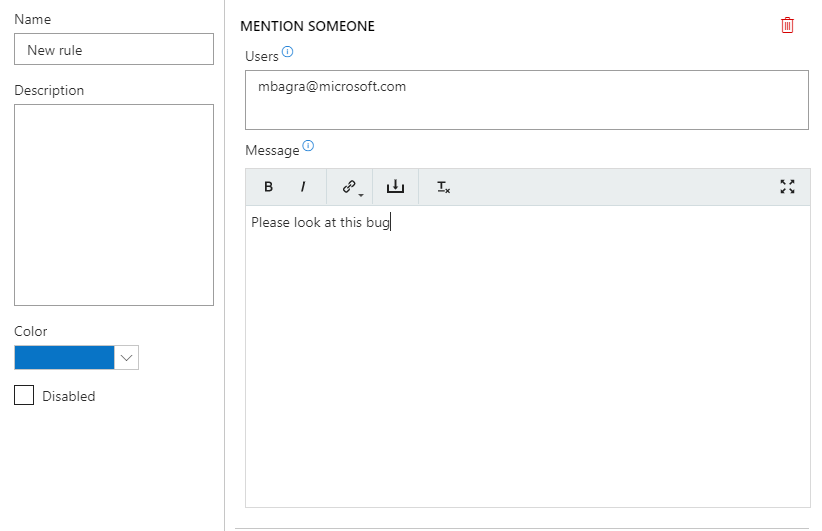
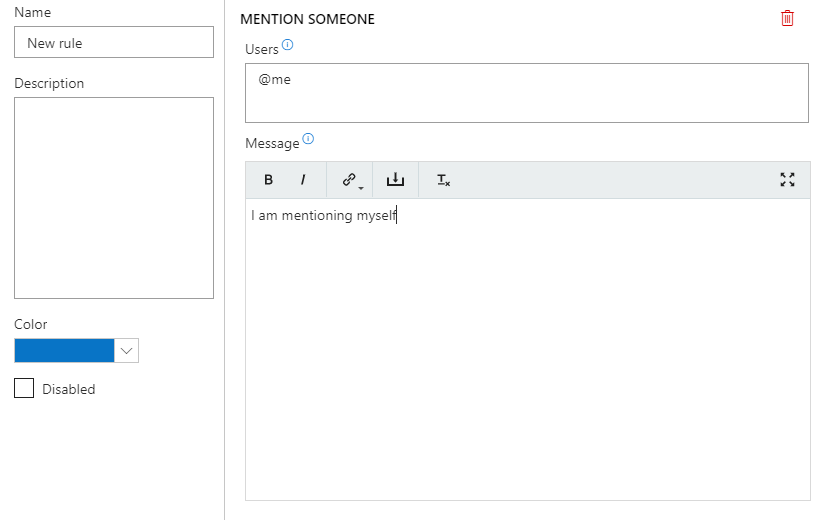

>UPDATE:
>A recent change in VSTS mention feature makes it incompatible with one click's "Mention someone" action. Due to this, mentioning someone is temporarily suspended from the extension.

# Changelog

**(03/03/18) Version 2.3:** 
* Added "Field changed trigger" which will be fired when a field changes on work item form. To configure this trigger, provide a field name, its old value and new value. For eg - FieldName="System.State", OldValue="New", NewValue="Active" will fire when State changes from New to Active. Users can also use "@any" macro as fieldValue (both for old and new). For eg, if OldValue="@any", then the trigger will fire when State changes from any value to "Active". If NewValue="@any", then the trigger will fire when State changes from "New" to any value.
* Added a support to hide a rule button in work item form. Just check the "Hide on form" checkbox in the rule editor to hide the rule button in the work item form. This would be useful for triggered rules which are meant to be fired automatically instead of manual clicks.
* Added a new attribute in "Add new linked work item" action which allows user to specify how they want to save the new linked workitem - automatically via rest api or manually via a work item dialog.

# Perform multiple actions from just a single click in work item form

A work item form group extension that lets users perform multiple actions on a workitem by just a single click. It shows up as a group in work item form where users can manage and perform one click actions.

* <a href="#overview">Overview</a>
* <a href="#rulegroups">Rule Groups</a>
* <a href="#subscribe">Subscribe</a>
* <a href="#actions">Actions</a>
* <a href="#triggers">Triggers</a>
* <a href="#macros">Macros</a>
* <a href="#reordering">Reordering rules</a>

## Overview ##

In the screenshot above, 2 rules have been created. Both the rules have multiple actions associated with them. By just clicking on each rule button, all the corresponding actions would be executed in a serial manner. For ex - Clicking on the second button will set the state of current work item to "Resolved" and set assigned to as empty all in one go. If any of the action in the rule failed for some reason, then all the actions after it wont be executed. 
Using the toolbar in the extension, users can go to settings page for this extension or refresh the rules from server. 

These rules are based on current work item type, project and user's rule subscriptions which we'll revisit below.

 

## Rule Groups ##

In the previous version of this extension where the rules were either private or global (global means visible to everyone in the account). This design would not scale well if there are thousands of users in an account, spread in different teams where each team want different kinds of rules.
The new version introduces a concept of rule groups which can hold a set of rules. The rule groups are defined per work item type, per project. So work item type "Bug" and work item type "Epic" in a project will have different sets of rule groups.

In the screenshot above, you can see rule groups for "Bug" for current project. By default, there'll be 2 rule groups automatically added for each work item type - "Personal" - which will hold a user's personal rules and "Global" which is mainly for back-compat, which will hold rules that would be visible to everyone in the account.
The rule groups and rules can be configured via a new Project level admin hub extension. You can visit the settings page by going to "WIT One click actions" hub in project admin page. You can also go to the settings of a Work item type directly from the work item form's one click extension by clicking the "gear" icon.

To create a rule group, click "New rule group", enter a name and description and hit save. This will create a rule group where user can now create rules. Users can now subscribe to a rule group by clicking on the "star" icon in the rule group list's row. The rule group view shows 2 tabs - "Favorite" and "All". Favorite tab will only show the rule groups that user has subscribed too. Once subscribed, the rules defined in that rule group will start to show up in the user's work item form for this particular work item type. By default, the rule groups are not auto-subscribed. We'll revisit subscription model later in this article.

 To open a rule group click on the link in its name in the rule groups list. This will open this view -

At this moment, there is no rule created in this group, so create one by clicking on "New rule" button which will open the Rule editor panel.

To add an action in this rule, select an action from the "Add action" dropdown -

This dropdown shows all the available actions in the extension. Right now the extension supports only 7 actions which will be described later in this document.

Clicking on an action from the dropdown will add that to the rule. For ex - if you click on "Set field value" action, it will add this -

Each action needs some user defined inputs. In the "Set field value" action, users can provide a field name and field value as input.

Users can then choose to add more actions to the set -

Users can also choose to provide a color to a rule, that color shows up as background color of the rule button in the extension. To delete an action from the rule, click on the "trash" icon on the right side of each action. 

 

## Subcribe to rules ##

Now that we can organize rules inside rule groups, users can subscribe to a rule group to pull its rules in his work item form. By default, a rule groups is not auto-subscribed to users. Users can subscribe to a rule group by clicking on the "star icon" in the rule groups list.
For eg, if there are 2 teams in a project -TeamA and TeamB. Both teams want different sets of rules in their work item forms. They'll create 2 rules groups -  one for each team. Each rule group will have different rules tailored for a particular team. Then members of TeamA can subscribe to TeamA rule group and members of TeamB can subscribe to TeamB rule group. Users can also manage a "Personal" rule group which is unique for each user. In this personal rule group, users can create rules which only they'll see in their work item form. There is also a "Global" rule group which will hold rules which will be seen by everyone.
Project admin can choose to disable Personal or Global rule groups for a work item type if they want - by clicking on the settings icon in the Rule groups list page. They can also disable a work item type if they dont want any rules to be created for a particular work item type, say "Test case".

If personal or global rule groups are disabled for a work item type, its workitem form wont show any personal or global rules and users wont be able to create any rules under these 2 rule groups.

 

## Actions ##

#### Set Field Value ####
This action lets user set a field value in the workitem. Note that this action will set the field value in the current work item form and not save the workitem automatically. To save the work item, add a "Save workitem" action. Users can also provide a macro as field value in this action. Macros are explain in detail later in this document.

In the example above, the rule has 2 "set field value" actions which sets priority and state fields. 

#### Mention someone ####
This action lets user mention a list of users (semicolon seperated list of email address) in the workitem. Performing this action will add a comment in the workitem dicsussion where these users will be mentioned. This action also doesnt save the workitem automatically, it'll just set the comment in the current work item form and dirty it. Users can also choose to provide an optional message in the action. Users can also provide a macro as "mentioned users" in this action. Macros are explain in detail later in this document.

In the example above, the rule will mention Mohit in the workitem and add the given message in the comment.

#### Save work item ####
This action lets user save the current workitem.

#### Add a comment ####
This action lets user enter a custom comment in the work item discussion.

#### Add/Remove Tags ####
These 2 actions lets user add or remove a list of tags in the work item. The input should be a semicolon seperated value -

#### Add a new linked workitem ####
This action will create a new workitem based on a configured work item template and link it to the current workitem using configured relation type.

#### Link to an existing work item ####
This action will link the current work item to an existing work item. You can either provide a static work item id or a @fieldValue macro to read the id from a field value from current work item.

 

## Triggers ##

Users can also configure triggers in a rule which would make the rule fire automatically when the configured trigger is fired. Right now only 1 trigger is available in the extension. In future, more can be added.

#### New work item load ####
This trigger would be fired whenever a new workitem form is opened. If this trigger is added in a rule, that rule would be fired (which means all actions in that rule will be executed automatically) whenever a new work item form is opened

#### Field changed ####
This trigger would be fired whenever a field value changes from a specified value to another specified value. Users can either put specific old and new values or use macros like @any, @fieldValue, @today or @me.

 

## Macros ##
Macros are dynamic values, whose values are picked up from the current work item state. For ex, instead of giving a static field value in "Set field value" action, users can choose to provide a macro like "@me" which will set the field value to the current user. Here's a list of available macros -

#### @Me Macro ####
This macro sets the value to the current user. This can be used in "Set Field value" action or "Mention" action -

#### @Today Macro ####
This macro sets the value to the current date. This can only be used in "Set Field value" action. Users can also choose to add/subtract certain number of days from @today by using "@today-2" or "@today+3"

#### @fieldValue Macro ####
This macro sets the value to the value of a given field. This can be used in "Set Field value" action or "Mention" action. In the example below, the macro sets the assigned to field value as the same value of field "Created By" and also mention the user which is the same value for "Created By" field.

These macros can also be used in work item template which is configured for "Add a new linked work item" action

#### @any Macro ####
This macro is only applicable in field changed trigger. In field changed trigger. Setting old field value to @any means fire the trigger when the field changes to any value to specified new value. Setting new field value to @any means fire the trigger when the field changes to specified old value to any new value. 

 

## Reordering rules ##
Each user can also reorder rules on his/her workitem form by simply dragging and dropping the buttons. The setting will be saved for future.