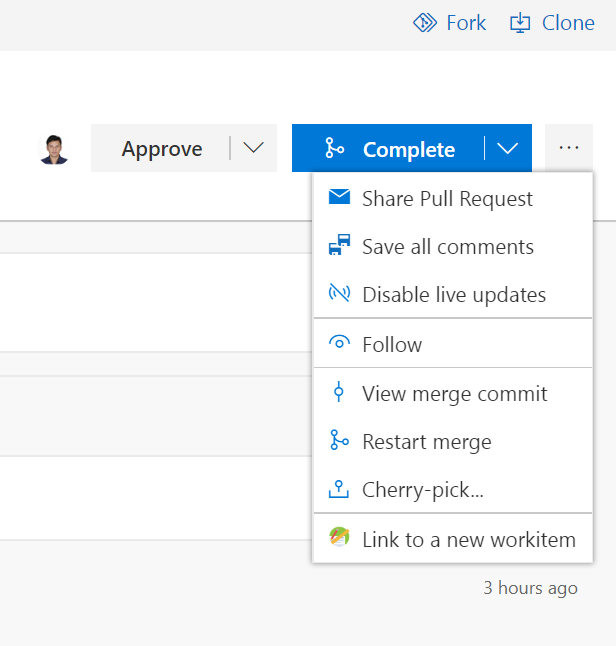

# Create a new workitem and link it to your Pull request

Have you ever come across a situation where you created a Pull request but forgot to create a work item for it. Now you can quickly create a workitem and associate it to your Pull request right from the PR page.

Just click on the new "Link to a new workitem" menu item to open a work item dialog. Enter the work item details in the dialog and hit save and this extension will automatically link the new workitem with your Pull request.

